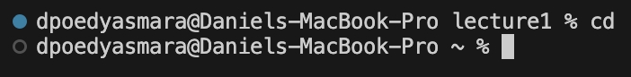
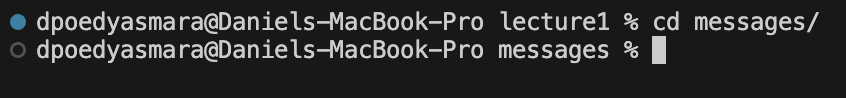
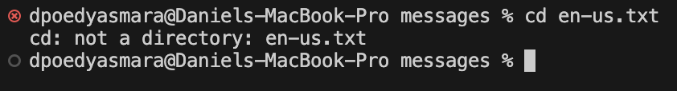
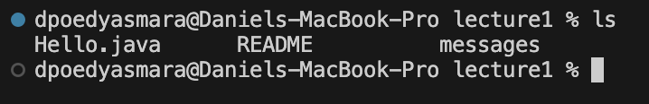
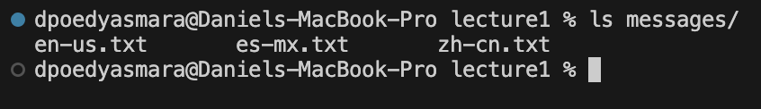
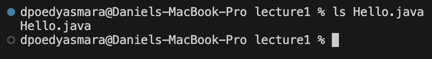
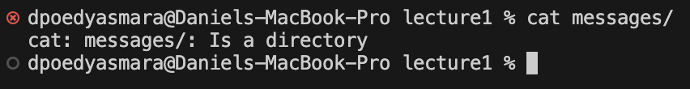
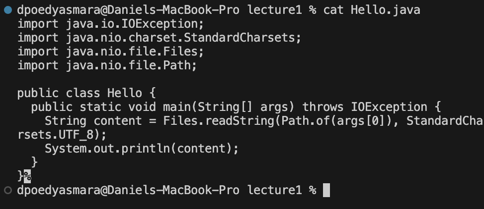

`cd` no argument
---
  
The absolute path to my working directory beforehand is `/Users/dpoedyasmara/Desktop/CSE 15L/lecture1`  
The output changes my working directory to my home directory which is `/Users/dpoedyasmara`. This is because there is no argument which specifies what directory I want to change my working directory to, so it defaults to change to my home directory. This output is not an error. 

`cd` directory argument
---
  
The absolute path to my working directory beforehand is `/Users/dpoedyasmara/Desktop/CSE 15L/lecture1`  
The output of this command changes my working directory to the directory `messages` within my current working directory. This is because the argument I provided was a relative path to the `messages` directory so this was where my working directory was changed to.
This output is not an error  

`cd` file argument
---
  
The absolute path to my working directory beforehand is `/Users/dpoedyasmara/Desktop/CSE 15L/lecture1/messages`  
The output of this command is `cd: not a directory: en-us.txt`. This is because the argument I provided was a relative path to a text file instead of a directory. This caused an error to output because the command `cd` (change directory) requires a directory argument in order to work. 

`ls` no argument
---
  
The absolute path to my working directory beforehand is `/Users/dpoedyasmara/Desktop/CSE 15L/lecture1`  
The output of this command displays the contents of the current working directory `Hello.java   README   messages`. This is because I did not provide any argument so it defaults to the current directory. This is not an error.  

`ls` directory argument
---
  
The absolute path to my working directory beforehand is `/Users/dpoedyasmara/Desktop/CSE 15L/lecture1`  
The output of this command displays the contents of the messages directory `en-us.txt   es-mx.txt   zh-cn.txt`. This is because I provided a relative path to the `messages` directory as the argument of the command. This is not an error.  

`ls` file argument
---
  
The absolute path to my working directory beforehand is `/Users/dpoedyasmara/Desktop/CSE 15L/lecture1`  
The output of this command displayed `Hello.java`. This is because the argument I provided was the file `Hello.java` and a file only contains itself so it will only output the file name. This is not an error.

`cat` no argument
---
  
The absolute path to my working directory beforehand is `/Users/dpoedyasmara/Desktop/CSE 15L/lecture1`  
There is no output to this command because there is no argument meaning there is nothing for the `cat` command to concatenate or display. This is not an error because the cat command is reading the data from its default input and outputting it.

`cat` directory argument
---
  
The absolute path to my working directory beforehand is `/Users/dpoedyasmara/Desktop/CSE 15L/lecture1`  
The output to this command is `cat: messages/: is a directory`. This is because the argument I input was the directory `messages` however the `cat` command only accepts files as arguments. Therefore an error message is output.  

`cat` file argument
---
  
The absolute path to my working directory beforehand is `/Users/dpoedyasmara/Desktop/CSE 15L/lecture1`  
The output to this command is the code within the `Hello.java` file. This is because there was no argument for the content of the file to be concatenated into, so the content of the argument I provided is just output into the terminal. This is not an error.
