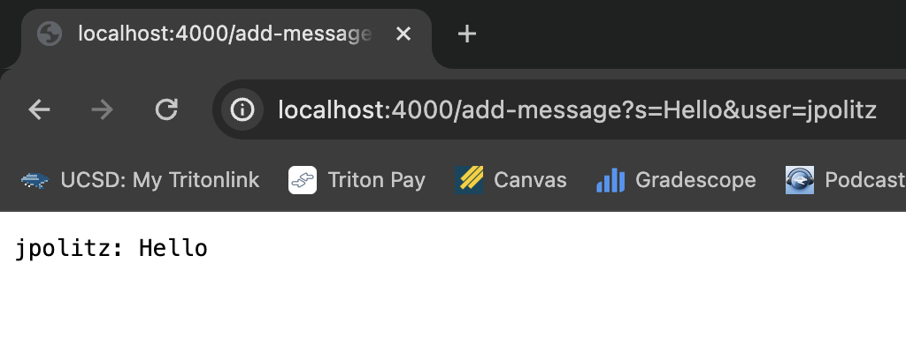
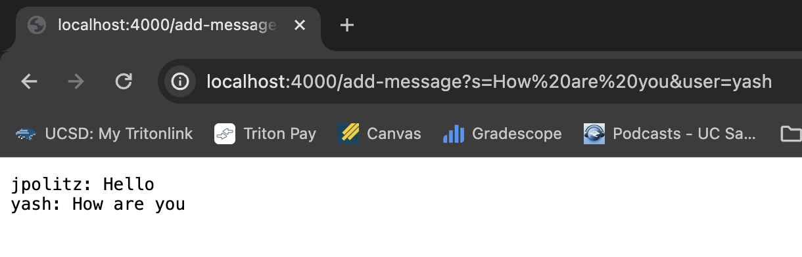
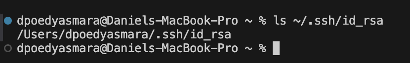
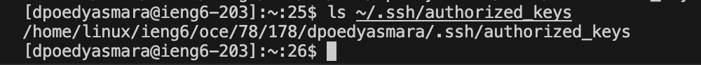
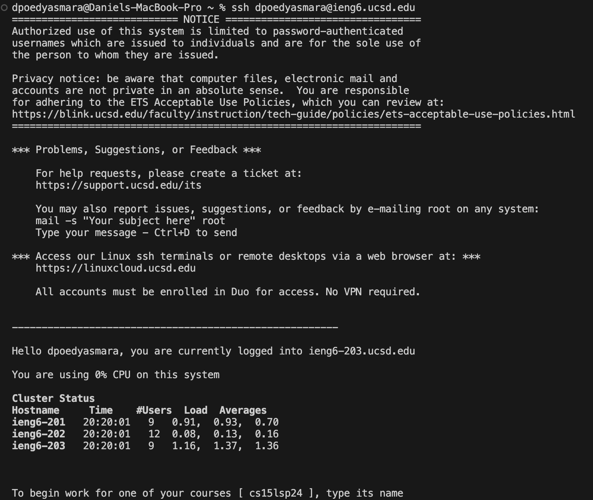

Part 1: ChatServer
---
.png)  
  
This command for the URL calls the `public String handleRequest` method within the `handler` class. This method separates the different parts of the URL path into `String[] parametersArray` to assign values to `String user` and `String message` based on the index of the string. The `String chatLog` field is then updated with the `message` and `user` formatted as "user: message \n".  
  
This next command also calls the `handleRequest` method in the same way to update a message to the webpage through `chatLog`. However, because the previous command already added a message to `chatLog`, the new message is added onto a new line and displayed onto the webpage as seen in the screenshot.  

Part 2: ieng login
---
  
  
  

Part 3: Information learned
---
Something I learned from this lab was that we could open a seperate Visual Studio Code environment for our `ssh` machine. It was also interesting and helpful to learn about the different parts of a browser URL and how it can command code with certain methods.
