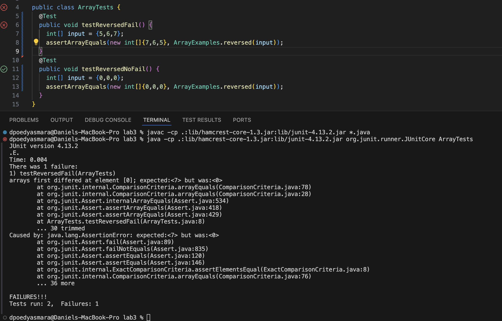

Part 1 - Bugs : Lab 4 method `reversed` bug
---
```
// input that induces a failure
@Test 
public void testReversedFail() {
  int[] input = {5,6,7};
  assertArrayEquals(new int[]{7,6,5}, ArrayExamples.reversed(input));
}
```
```
// input that doesn't induce a failure
@Test
public void testReversedNoFail() {
  int[] input = {0,0,0};
  assertArrayEquals(new int[]{0,0,0}, ArrayExamples.reversed(input));
}
```
Symptom Output
 <br>
```
// bugged method before
static int[] reversed(int[] arr) {
  int[] newArray = new int[arr.length];
  for(int i = 0; i < arr.length; i += 1) {
    arr[i] = newArray[arr.length - i - 1];
  }
  return arr;
}
```
```
// fixed method
static int[] reversed(int[] arr) {
  int[] newArray = new int[arr.length];
  for(int i = 0; i < arr.length; i += 1) {
    newArray[i] = arr[arr.length - i - 1];
  }
  return newArray;
}
```
<br>

This fix addresses the issue in the code because the original method assigns values from the newly created `newArray` into the original `arr`, then it returns the original variable `arr`. This causes the method to always return an array full of zeros due to the default int value in integer arrays being zero. The method was changed by instead assigning `arr` values to `newArray` then returning `newArray` to reverse the array.

Part 2 - Researching Commands : grep command
---
grep -c
grep -m
grep -r
