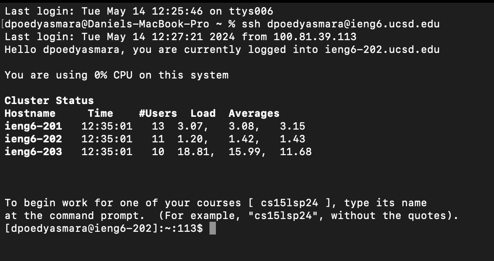
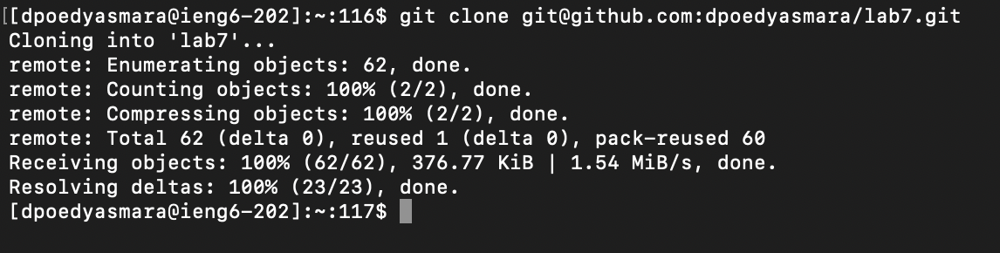
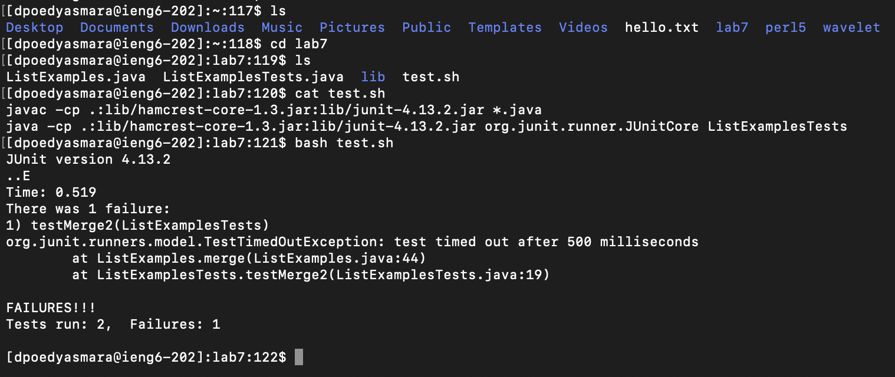
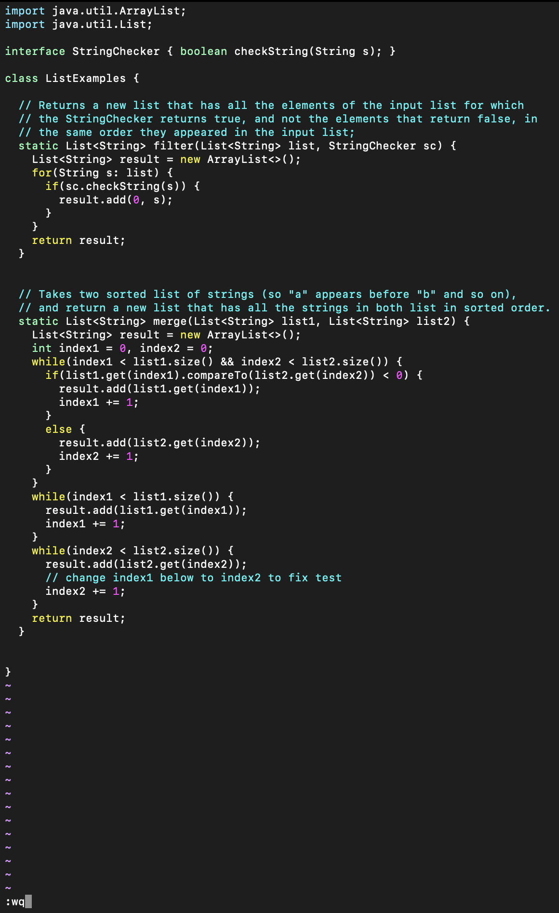
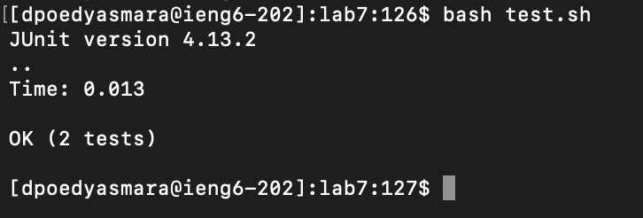
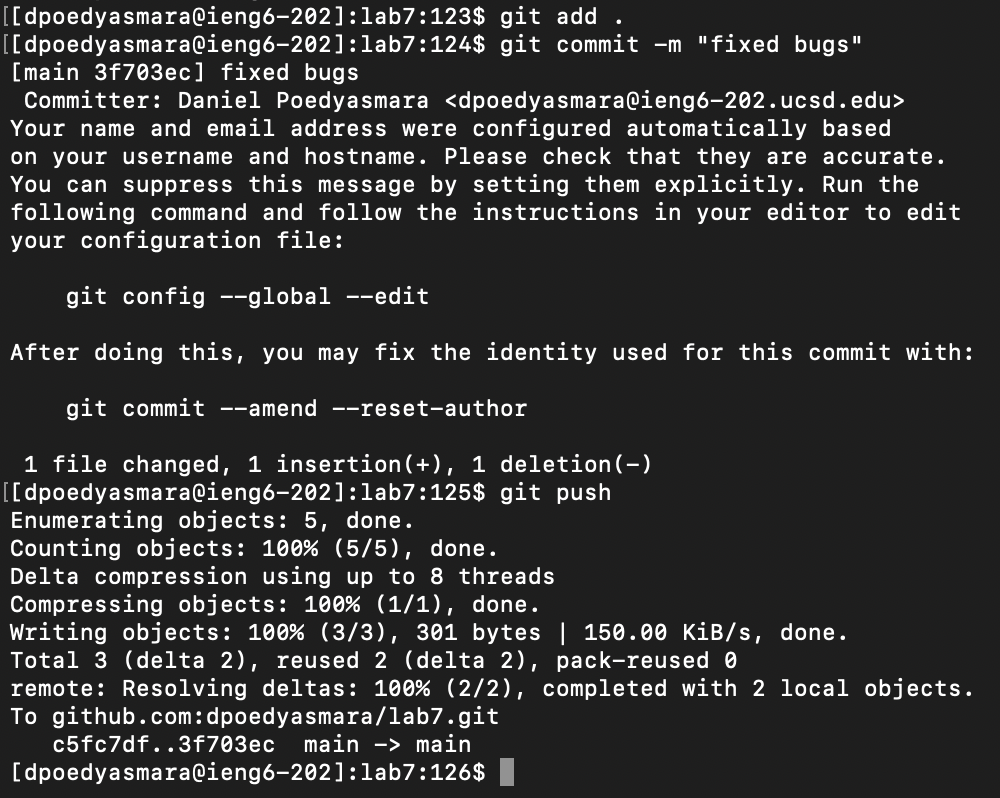

Login 
---
  
Keys Pressed:  
`ssh<space>dpoedyasmara@ieng6.ucsd.edu<enter>`  
These keystrokes allow me to log into the ieng6 UCSD machines using my personal username and saved password.

Clone
---
  
Keys Pressed:  
`git<space>clone<space><command>v<enter>`  
This command clones my forked git repository for `lab7`. `Command + V` pastes the link I copied from my git repository.

Run Failing Tests
---
  
Keys Pressed:  
`ls<enter>`, `cd<space>lab7<enter>`, `ls<enter>`, `cat<space>test.sh<enter>`, `bash<space>test.sh<enter>`  
My first command here displays the contents of my working directory. My second command changes my present working directory to the `lab7` directory. The third command once again displays the contents of my working directory, which is now `lab7`. The next command displays the contents of the `test.sh` file, allowing me to make sure the correct commands I need are in this file. The last command runs the bash file `test.sh` allowing us to see that 1 of the 2 tests failed.

VIM Edit Tests
---
  
Keys Pressed:  
`vim<space>ListExamples.java<enter>`, `43j<enter>`, `e`, `r`, `2`,`:wq<enter>`  
My first command in this step allows me to enter the vim workspace for the `ListExamples.java` file. The second command moves my cursor selection down 43 lines to the line I need to edit. The e keystroke takes my cursor selection to the end of the next word which is originally index1. The r keystroke allows me to replace the character that is currently selected. Typing 2 after the r keystroke replaces the original character `1` to `2`. Lastly `:wq<enter>` saves the file's edits and exits the vim workspace.

Run Successful Tests
---
  
Keys Pressed:  
`bash<space>test.sh<enter>`  
This command once again runs the bash file `test.sh` with the updated version of `ListExamples.java` and tells us that 2 of 2 tests passed.

Commit and Push to Github
---
  
Keys Pressed:  
`git<space>add<space>.<enter>`, `git<space>commit<space>-m<space>"fixed<space>bugs"`, `git<space>push`  
These commands overall update and save the git then commit upload it to my original forked github repository. The period argument for `git add` tells the machine to update the present working directory instead of a singular file. The arguments for `git commit` specify to the machine what commit message I will use. Finally `git push` uploads the changes to my personal lab7 forked git repository.
